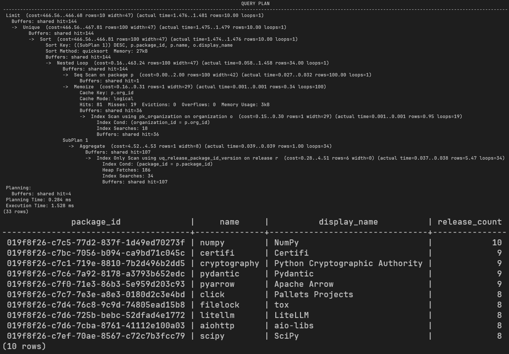
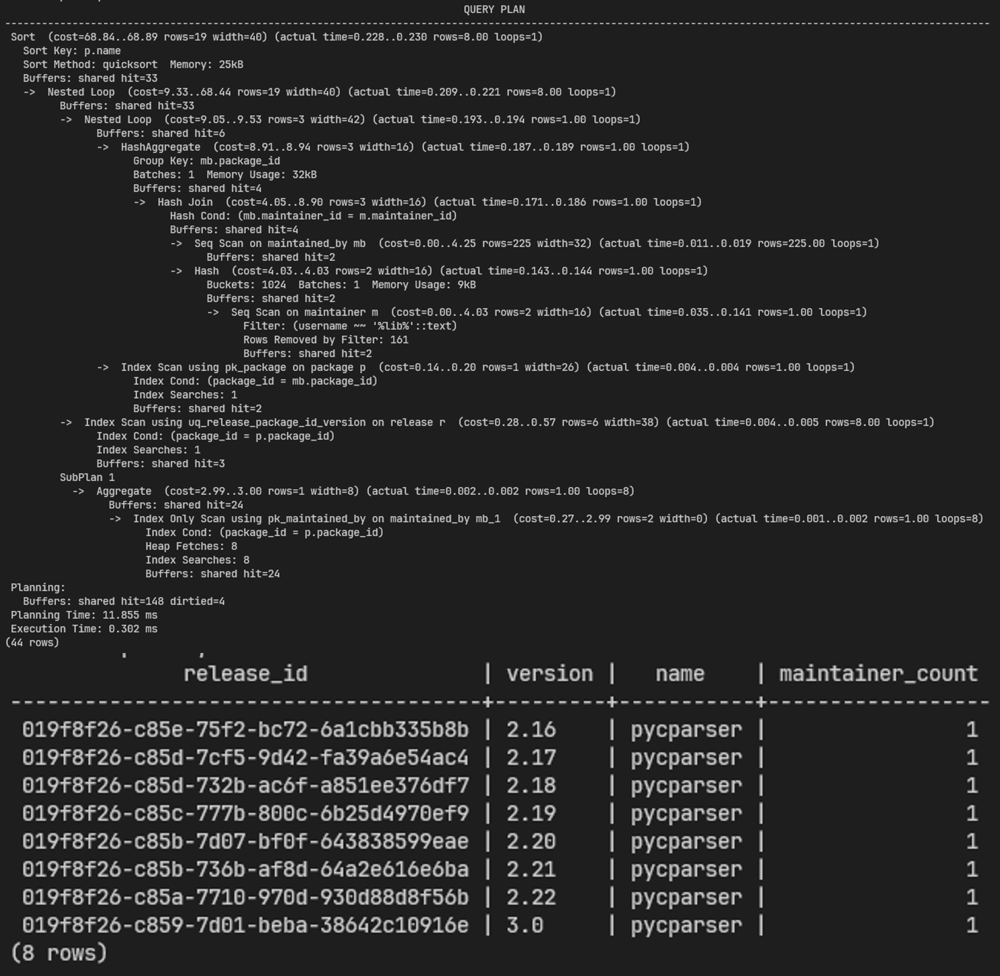
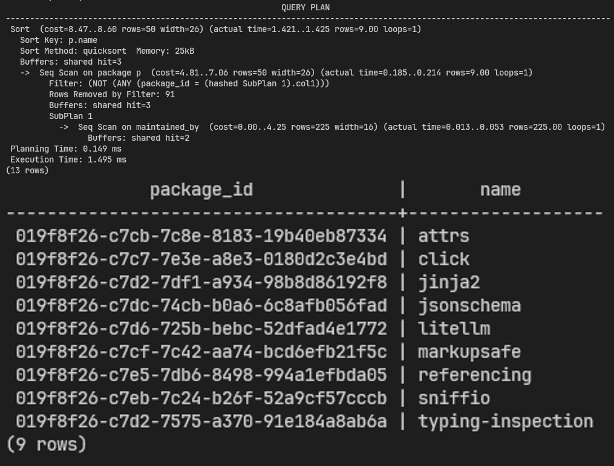
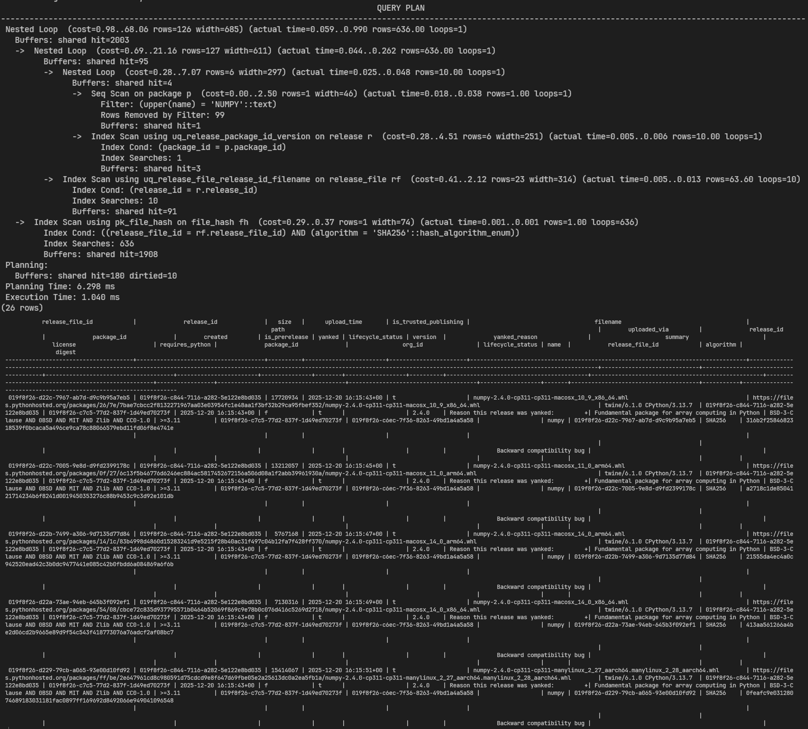
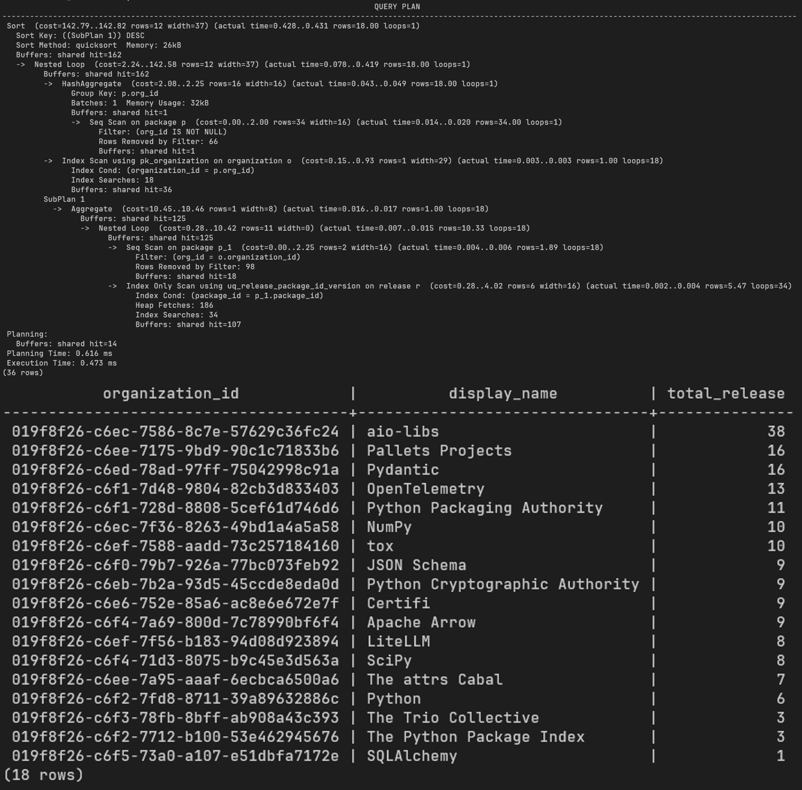

# `006_db_query`

Modul ini berisi kumpulan query awal untuk mengambil data dari database PyPI yang sudah disimpan di [`005_data_storing/`](../005_data_storing/README.md).

Seluruh query ada di [`px_QUERY.sql`](px_QUERY.sql).

## Penjelasan Query

### Query #1: Package dengan release terbanyak

Mengambil 10 package dengan jumlah release terbanyak beserta nama organisasi pemiliknya. Jumlah release dihitung lewat subquery `COUNT(*)` yang dijalankan dua kali, sekali di kolom `SELECT` dan sekali lagi di `ORDER BY`, karena alias `release_count` tidak bisa langsung dipakai di `ORDER BY` tanpa mengulang subquery-nya. Relasi antara `package` dan `organization` ditulis sebagai implicit join lewat `FROM package p, organization o` dengan syarat kecocokan di klausa `WHERE`, bukan lewat `JOIN ... ON`.

### Query #2: Release dari package dengan maintainer mengandung 'lib'

Mengambil data release dari package yang punya maintainer dengan username mengandung kata 'lib'. Daftar `package_id` yang memenuhi syarat itu didapat lewat subquery `IN (...)` yang di dalamnya sendiri masih berupa implicit join antara `maintained_by` dan `maintainer`. Jumlah maintainer per package juga dihitung lewat subquery terpisah di kolom `SELECT`, bukan lewat agregasi `GROUP BY`.

### Query #3: Package tanpa maintainer

Mengambil package yang belum pernah dimiliki oleh maintainer manapun, dicari dengan `NOT IN` terhadap subquery yang mengambil seluruh `package_id` di tabel `maintained_by`. Pendekatan `NOT IN` ini tidak memfilter nilai `NULL` di dalam subquery, jadi kalau ada `package_id` yang bernilai `NULL` di `maintained_by`, hasil query bisa jadi kosong secara tidak terduga.

### Query #4: Release file dan hash SHA256 dari package tertentu

Mengambil data `release_file` beserta hash SHA256-nya untuk package dengan nama tertentu ('numpy'), dengan pencarian nama case-insensitive lewat `UPPER()` di kedua sisi perbandingan. Seluruh tabel yang terlibat (`release_file`, `release`, `package`, `file_hash`) digabung lewat implicit join di klausa `FROM` dengan daftar kondisi kecocokan di `WHERE`. Query ini juga memakai `SELECT *`, jadi seluruh kolom dari keempat tabel ikut terbawa meskipun tidak semuanya dibutuhkan.

### Query #5: Ringkasan jumlah release per organisasi

Mengambil ringkasan jumlah release per organisasi, diurutkan dari yang terbanyak. Jumlah release dihitung lewat subquery bertingkat, subquery terluar menghitung `COUNT(*)` dari `release`, dan di dalamnya ada subquery lagi yang mengambil daftar `package_id` milik organisasi tersebut lewat `IN (...)`. Klausa `WHERE o.organization_id IN (...)` di level utama juga memakai subquery terpisah untuk memastikan organisasi yang muncul hanya yang memang punya package.

## Tabel Screenshot Hasil Eksekusi

| No | Deskripsi | Screenshot |
|---|---|---|
| 1 | Package dengan jumlah release terbanyak beserta nama organisasi pemiliknya |  |
| 2 | Release dari package yang memiliki maintainer dengan username mengandung 'lib' |  |
| 3 | Package yang belum pernah dimiliki oleh maintainer manapun |  |
| 4 | Release file beserta hash SHA256 dari package tertentu (pencarian case-insensitive) |  |
| 5 | Ringkasan jumlah release per organisasi, diurutkan dari yang terbanyak |  |
