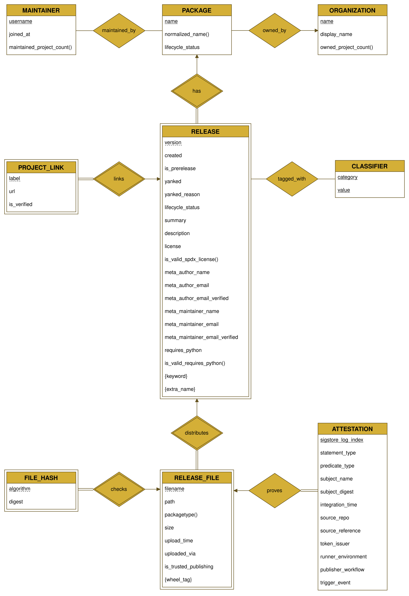
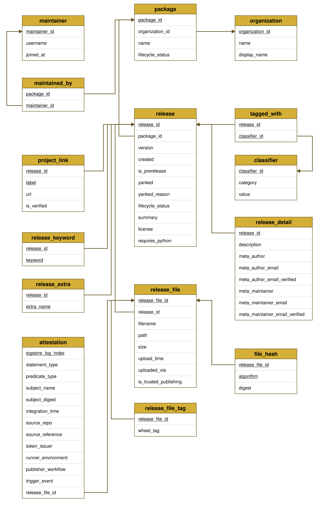

<div align="center">


# pxnotpixel

Sistem Workflow ETL untuk Data PyPI. Seleksi Asistem Laboratorium Basis Data 2026

[](https://go.dev)
[](https://www.python.org)
[](https://www.postgresql.org)
[](https://www.docker.com)
[](https://pandas.pydata.org)

</div>

## Identitas

* Nama: **Muhammad Zulfa Fauzan Nurhuda**
* NIM: **18224064**

## Deskripsi Proyek

`pxnotpixel` adalah pipeline ETL yang mengambil data metadata package dari PyPI (PyPI, singkatan Python Package Index, adalah repositori resmi paket Python), lalu menyimpannya sebagai basis data relasional di PostgreSQL 18. Data yang dikumpulkan mencakup package, rilis (release), file rilis beserta hash-nya, maintainer, organisasi pemilik package, dan klasifikasi (classifier), diambil langsung dari halaman publik `pypi.org` tanpa memakai API resmi PyPI.

Topik ini dipilih dengan tiga alasan utama. Pertama, `pypi.org` di-server-render penuh (server-side rendering), jadi seluruh data yang dibutuhkan sudah tersedia di HTML respons pertama tanpa perlu headless browser atau eksekusi JavaScript, cukup HTTP client dan parser HTML biasa. Kedua, penulis sudah terbiasa memakai Python untuk kebutuhan data dan scripting, sehingga familiar dengan domain package management dan struktur ekosistemnya. Ketiga, software di balik `pypi.org` (Warehouse) bersifat open source dan skema datanya terdokumentasi terbuka, sehingga struktur data yang di-scrape bisa diverifikasi langsung terhadap sumber aslinya, bukan hasil tebakan dari tampilan halaman saja.

## Alur Kerja

Pipeline-nya terdiri dari lima tahap berurutan, dari scraping data mentah sampai data siap di-query di database relasional. Tiap tahap adalah modul folder tersendiri dengan README detailnya masing-masing.

```
001_data_scraping  ->  002_data_modelling  ->  003_data_transformer  ->  004_data_loader  ->  005_data_storing  ->  006_db_query -> b003_db_query_optimize
```

### 1. Scraping Data

Scraper (`pxs`, PyPI eXtractor Script) dijalankan langsung tanpa argumen atau flag apapun. Sekali jalan, program mengambil data 100 package (nama, rilis, file, hash, maintainer, organisasi, classifier, dan seterusnya) dari `pypi.org`, lalu menuliskannya sebagai 15 file JSON per entity ke folder output baru bertimestamp, jadi hasil dari run sebelumnya tidak pernah tertimpa. Karena scraper berjalan sebelum basis data ada, seluruh relasi antar entity ditulis memakai natural key (nama package, versi, username), bukan UUID surrogate.

Lihat [`001_data_scraping/README.md`](001_data_scraping/README.md) untuk detail lengkap cara menjalankan, sumber halaman yang di-scrape, dan struktur JSON yang dihasilkan.

### 2. Pemodelan Data

Struktur data hasil scraping dimodelkan jadi ERD, lalu ditranslasikan jadi skema relasional PostgreSQL, dan dibuktikan berada di BCNF.





Translasi dari ERD ke skema relasional mengikuti aturan mapping standar: setiap entity (strong maupun weak) direduksi jadi tabel, dengan tabel weak entity memuat primary key tabel owner-nya digabung discriminator sendiri, relationship 1:N cukup jadi kolom foreign key di sisi banyak, sementara relationship many-to-many (`maintained_by` antara package dan maintainer, `tagged_with` antara release dan classifier) direduksi jadi tabel junction tersendiri karena tidak ada sisi yang secara fungsional menentukan sisi lain. Beberapa tabel (`package`, `organization`, `maintainer`, `release`, `release_file`) memakai surrogate key `UUID` menggantikan candidate key natural yang sering direferensikan tabel anak, dan tabel `release` dipartisi vertikal menjadi `release` dan `release_detail` untuk memisahkan kolom besar seperti deskripsi dari kolom yang sering di-scan.

Lihat [`002_data_modelling/README.md`](002_data_modelling/README.md) untuk detail lengkap ERD, skema relasional, dan bukti normalisasi.

### 3. Pembersihan dan Transformasi Data

Sebelum dimuat ke database, JSON hasil scraping dibersihkan dan divalidasi: kolom identifier yang kepanjangan di-drop barisnya (bukan dipotong, karena truncate mengubah identitas), kolom deskriptif yang kepanjangan dipotong dengan elipsis, nilai enum yang tidak valid di-drop, dan kolom yang hilang diisi `null` eksplisit. Tahap ini juga membuat baris placeholder untuk maintainer yang profilnya gagal di-scrape, supaya relasi `maintained_by` tetap valid saat dimuat ke database. Bentuk data (JSON per entity, natural key) tetap sama, cuma nilainya yang dijamin bersih.

Lihat [`003_data_transformer/README.md`](003_data_transformer/README.md) untuk detail lengkap aturan pembersihan dan alasan tiap keputusannya.

### 4. Pemuatan ke Database

Data yang sudah bersih dimuat ke PostgreSQL: UUID surrogate untuk tiap baris digenerate langsung oleh Postgres (`uuidv7()`) lewat `INSERT ... RETURNING`, sementara natural key di data (nama package, versi, username) diresolusi jadi foreign key lewat peta di memori. Seluruh 15 tabel di-TRUNCATE lebih dulu baru diisi ulang, semuanya dalam satu transaksi, supaya tidak pernah ada data setengah jadi kalau ada baris yang gagal dimuat.

Lihat [`004_data_loader/README.md`](004_data_loader/README.md) untuk detail lengkap urutan pemuatan dan kebijakan transaksinya.

### 5. Penyimpanan Database

Database PostgreSQL 18 dijalankan lewat Docker Compose, dengan skema, collation, custom type, dan tuning performa sudah didefinisikan lewat script inisialisasi yang idempoten.

Lihat [`005_data_storing/README.md`](005_data_storing/README.md) untuk detail lengkap cara menyalakan database dan konfigurasinya.

### 6. Query dan Optimasi

Setelah data ada di database, lima query dijalankan untuk mengambil insight dari data yang sudah tersimpan.

Lima query awal ditulis dengan pendekatan implicit join dan subquery, sebagai versi belum dioptimasi. Detail penjelasan tiap query ada di [`006_db_query/README.md`](006_db_query/README.md).

| No | Deskripsi | Screenshot |
|---|---|---|
| 1 | Package dengan jumlah release terbanyak beserta nama organisasi pemiliknya |  |
| 2 | Release dari package yang memiliki maintainer dengan username mengandung 'lib' |  |
| 3 | Package yang belum pernah dimiliki oleh maintainer manapun |  |
| 4 | Release file beserta hash SHA256 dari package tertentu (pencarian case-insensitive) |  |
| 5 | Ringkasan jumlah release per organisasi, diurutkan dari yang terbanyak |  |

`[BONUS]` Kelima query di atas dioptimasi memakai explicit JOIN, agregasi `GROUP BY` sekali jalan, `EXISTS`/`NOT EXISTS`, dan index yang sesuai. Detail penjelasan teknik optimasi tiap query ada di [`b003_db_query_optimize/README.md`](b003_db_query_optimize/README.md).

| No | Deskripsi | Screenshot |
|---|---|---|
| 1 | Package dengan jumlah release terbanyak beserta nama organisasi pemiliknya |  |
| 2 | Release dari package yang memiliki maintainer dengan username mengandung 'lib' |  |
| 3 | Package yang belum pernah dimiliki oleh maintainer manapun |  |
| 4 | Release file beserta hash SHA256 dari package tertentu (pencarian case-insensitive) |  |
| 5 | Ringkasan jumlah release per organisasi, diurutkan dari yang terbanyak |  |

## Referensi

Library yang dipakai:

- [`goquery`](https://github.com/PuerkitoBio/goquery), parsing HTML di scraper Go.
- [`pgx/v5`](https://github.com/jackc/pgx), driver PostgreSQL untuk Go.
- [`pandas`](https://pandas.pydata.org), pembersihan dan transformasi data di Python.

Halaman yang di-scrape:

- [`pypi.org/project/<name>/`](https://pypi.org/project/), halaman utama dan riwayat rilis package.
- [`pypi.org/user/<username>/`](https://pypi.org/user/), profil maintainer.

Sumber tambahan:

- [`hugovk.dev/top-pypi-packages`](https://hugovk.dev/top-pypi-packages/), daftar package PyPI paling populer, dipakai sebagai kandidat scraping.
- [`docs.pypi.org`](https://docs.pypi.org), dokumentasi resmi PyPI, termasuk atestasi (attestation) dan trusted publishing.
