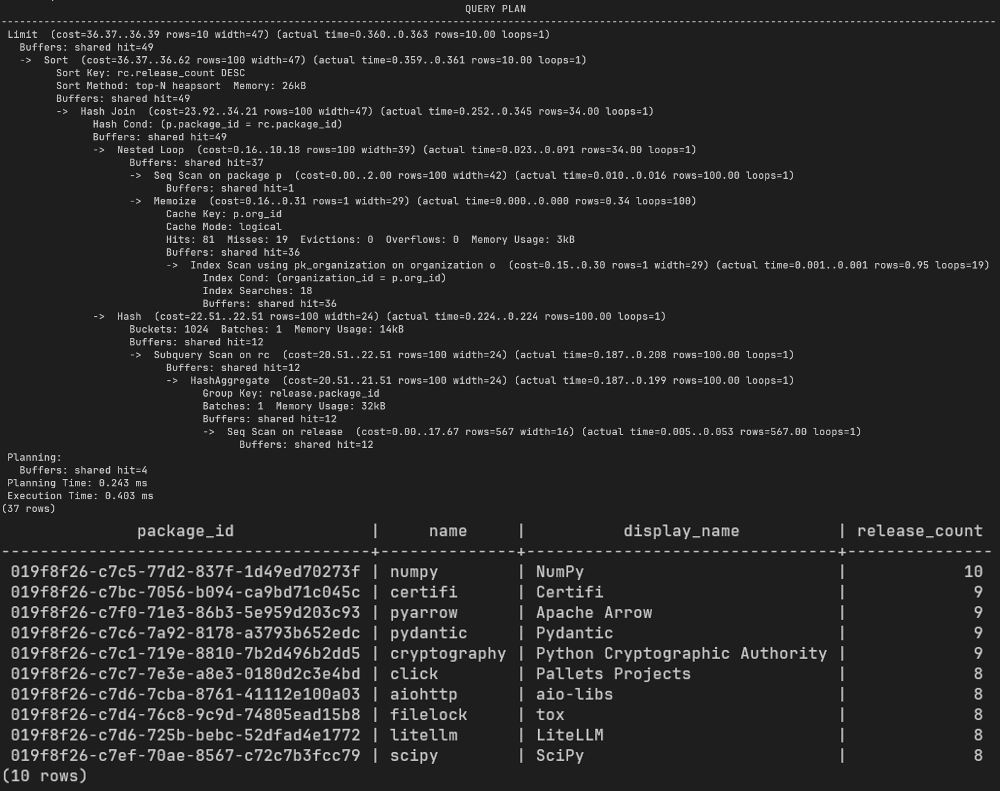
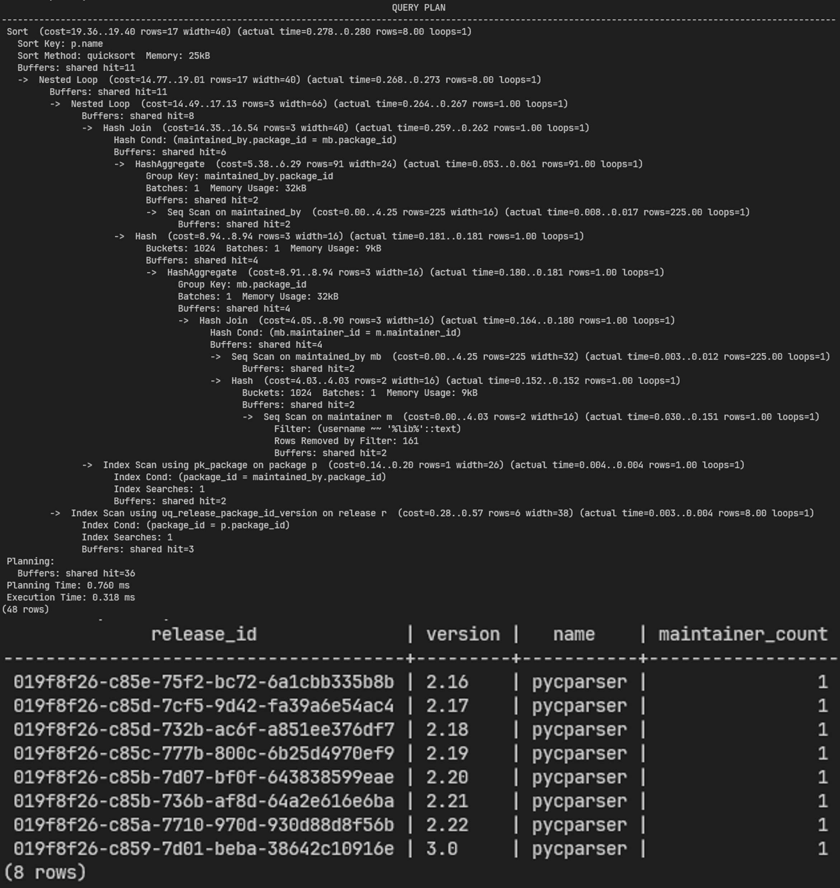
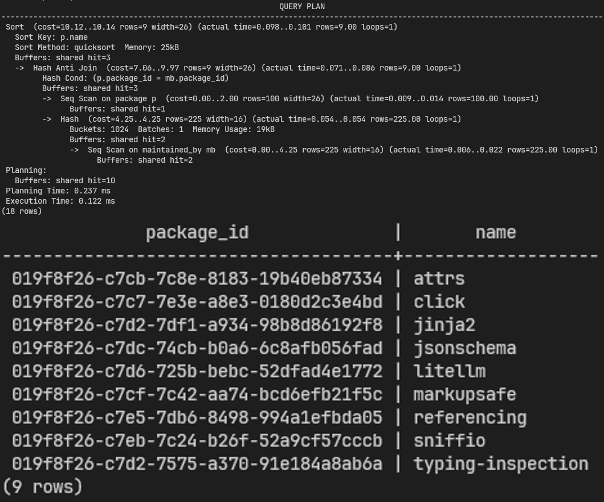
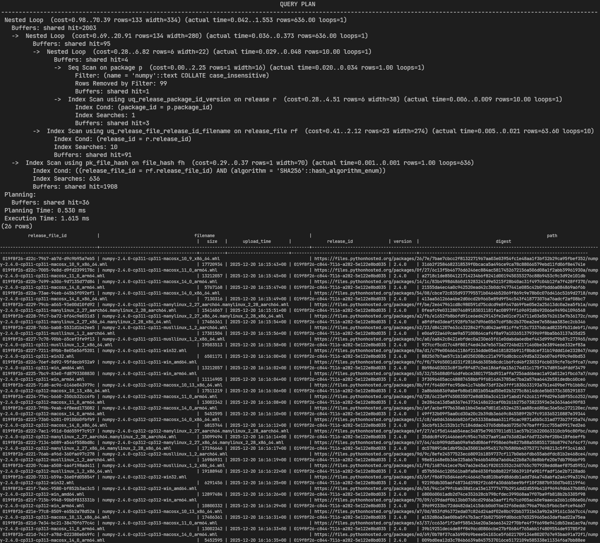
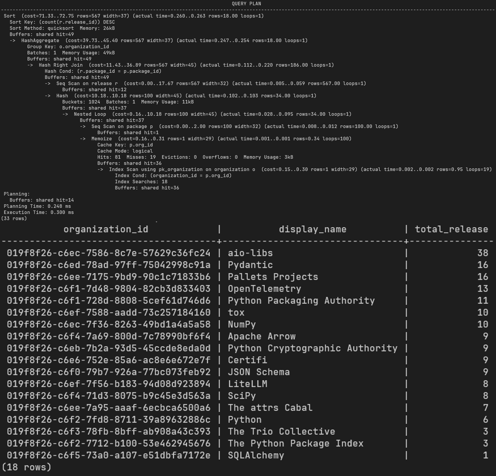

# `b003_db_query_optimize`

Modul ini berisi versi optimasi dari 5 query di [`006_db_query/px_QUERY.sql`](../006_db_query/px_QUERY.sql). Pendekatan implicit join, subquery berulang, dan `NOT IN`/`IN` terhadap subquery di versi awal diganti dengan explicit JOIN, agregasi `GROUP BY` sekali jalan, serta `EXISTS`/`NOT EXISTS` yang lebih aman terhadap NULL.

Seluruh query ada di [`px_QUERY_OPTIMIZE.sql`](px_QUERY_OPTIMIZE.sql).

## Penjelasan Query dan Teknik Optimasi

### Query #1: Package dengan release terbanyak

Mengambil 10 package dengan jumlah release terbanyak beserta nama organisasi pemiliknya. Di versi awal, `COUNT(*)` dihitung lewat correlated subquery yang dijalankan dua kali (di `SELECT` dan di `ORDER BY`) untuk tiap baris package. Di versi optimasi, penghitungan itu dipindah ke subquery `rc` yang melakukan `GROUP BY package_id` sekali untuk seluruh tabel `release`, lalu hasilnya di-JOIN ke `package`. `ORDER BY` juga langsung memakai alias `rc.release_count`, tidak perlu mengulang subquery. Implicit join `FROM package p, organization o WHERE ...` diganti explicit `JOIN organization o ON o.organization_id = p.org_id`.

### Query #2: Release dari package dengan maintainer mengandung 'lib'

Mengambil data release dari package yang punya maintainer dengan username mengandung kata 'lib'. Pola yang sama seperti Query #1 dipakai untuk `maintainer_count`: agregasi `GROUP BY package_id` pada subquery `mc`, bukan subquery `COUNT(*)` per baris. Pemeriksaan keanggotaan `p.package_id IN (subquery implicit join)` diganti `EXISTS (correlated subquery dengan explicit JOIN)`, sehingga mesin database bisa berhenti begitu menemukan satu baris cocok, tanpa perlu membangun seluruh daftar `package_id` hasil subquery lebih dulu.

### Query #3: Package tanpa maintainer

Mengambil package yang belum pernah dimiliki oleh maintainer manapun. Versi awal memakai `NOT IN (SELECT package_id FROM maintained_by)`, yang berisiko: kalau ada satu saja baris `package_id` bernilai NULL di subquery, seluruh hasil `NOT IN` menjadi kosong secara tidak terduga. Versi optimasi memakai `NOT EXISTS (correlated subquery)`, yang mengevaluasi kecocokan per baris `package` dan tidak terpengaruh NULL di tabel `maintained_by`.

### Query #4: Release file dan hash SHA256 dari package tertentu

Mengambil data `release_file` beserta hash SHA256-nya untuk package dengan nama tertentu ('numpy'), pencarian case-insensitive. Tiga perubahan utama: implicit join 4 tabel (`release_file`, `release`, `package`, `file_hash`) diganti rangkaian explicit `JOIN ... ON`; `SELECT *` diganti daftar kolom eksplisit yang memang dibutuhkan; dan `UPPER(p.name) = UPPER('numpy')` diganti `p.name = 'numpy' COLLATE case_insensitive`. Perbandingan lewat fungsi `UPPER()` di kedua sisi membuat index pada `p.name` tidak bisa dipakai langsung, sedangkan collation case-insensitive tetap ramah index karena tidak membungkus kolom dengan fungsi.

### Query #5: Ringkasan jumlah release per organisasi

Mengambil ringkasan jumlah release per organisasi, diurutkan dari yang terbanyak. Versi awal menghitung `COUNT(*)` lewat subquery bertingkat (subquery di dalam subquery) plus klausa `WHERE o.organization_id IN (subquery)` untuk membatasi organisasi yang punya package. Versi optimasi menggantinya dengan `JOIN package p ON p.org_id = o.organization_id` diikuti `LEFT JOIN release r ON r.package_id = p.package_id`, lalu `GROUP BY o.organization_id, o.display_name` dengan `COUNT(r.release_id)`. Pemakaian `LEFT JOIN` di sisi `release` membuat organisasi yang punya package tapi belum punya release sama sekali tetap muncul dengan `total_release` 0, bukan malah hilang dari hasil seperti berpotensi terjadi di versi awal.

## Tabel Screenshot Hasil Eksekusi

| No | Deskripsi | Screenshot |
|---|---|---|
| 1 | Package dengan jumlah release terbanyak beserta nama organisasi pemiliknya |  |
| 2 | Release dari package yang memiliki maintainer dengan username mengandung 'lib' |  |
| 3 | Package yang belum pernah dimiliki oleh maintainer manapun |  |
| 4 | Release file beserta hash SHA256 dari package tertentu (pencarian case-insensitive) |  |
| 5 | Ringkasan jumlah release per organisasi, diurutkan dari yang terbanyak |  |
